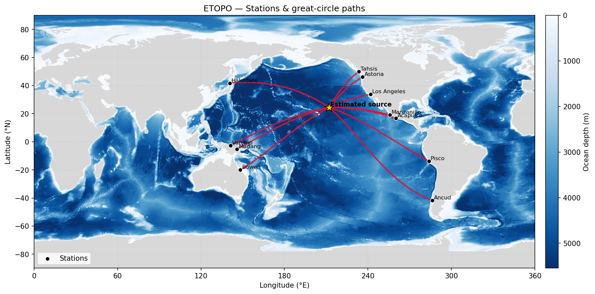

# 🌊 **Project Tsunami — Source Inversion & Travel-Time Modelling**

### M1 Geology — *Institut de Physique du Globe de Paris (IPGP)*
**Course:** *Data Analysis in Geosciences*  
**Supervision:** *E. Gayer, C. Narteau, F. Beauducel*  

**Authors:** [**Maxime Soares Correia**](https://maxsc4.github.io/) & **Matthieu Courcelles**

---

<p align="center">
  
</p>

---

## 📘 Overview

**Project Tsunami** is an educational and research-oriented geophysics project developed as part of the *Data Analysis in Geosciences* course (M1 Geology, IPGP).

The goal is to:
- **model tsunami propagation** using shallow-water theory,
- **compute travel times** along oceanic great-circle paths, and
- **invert for the tsunami source location and origin time** using observed arrival times at stations.

Starting from:
- a global **ETOPO5** bathymetric grid, and
- a dataset of **tsunami arrival times** at Pacific coastal stations,

the project determines the **most likely source position** and a physically consistent **origin time**.

---

## ⚙️ Methodology

### 1. Bathymetry loading
The ASCII ETOPO5 grid is loaded using `io_etopo.py`, which provides:

```python
depth(lat, lon)  # returns interpolated water depth (m)
```

Longitude wrapping, interpolation, and missing-value management are handled internally.

---

### 2. Great-circle geometry
Propagation paths are assumed to follow **geodesics** on a spherical Earth.
The module `geo.py` provides:

- great-circle coordinates,
- arc length computations,
- spherical trigonometric tools.

This ensures physically realistic first-order propagation directions.

---

### 3. Tsunami speed model
The project uses the classical shallow-water phase speed approximation:
$$v(h) = \sqrt{g\,h}$$
where:
- **$h$** = local depth,
- **$g = 9.81\ \text{m/s}^2$**.

This neglects dispersion and refraction, but remains valid for long-wavelength tsunamis propagating across the open ocean.

---

### 4. Travel-time computation
Propagation time is obtained via numerical integration along the geodesic:
$$T = \int_{\text{path}} \frac{ds}{v(h(s))}$$
The integrator in `speed_integrator.py`:
- samples the path at hundreds to thousands of points,
- evaluates depth at each point,
- computes local speed,
- integrates without requiring any coastal trimming.

Vectorization ensures efficient computation for all stations.

---

## 🔍 5. Source inversion

The inversion estimates:
- **source latitude**
- **source longitude**
- **origin time** $t_0^*$

by minimizing the physically meaningful RMS misfit:
$$\text{misfit} =\sqrt{\frac{1}{N}\sum_i \Big(t_{\mathrm{obs},i} - (t_0^*  T_i)\Big)^2 }$$
Key features:
- **adaptive grid search** with progressive refinement,
- **robust estimation** of $t_0^*$ using the median of residuals,
- **no free-scale regression** (the slope is physically fixed to 1),
- **outlier clipping** available.

This method ensures stability even with imperfect bathymetry and sparse station geometry.

---

## 📊 6. Diagnostics & Uncertainty Analysis

### Observed vs Modelled Arrival Times
The module `diagnostics.py` produces a figure comparing:
- observed arrival times,
- predicted travel times,
- regression-free and free-slope fits.

This diagnostic is essential for identifying systematic biases:
- overestimated depths,
- refractive path differences,
- early/late detection at tide gauges.

### Misfit Profiles & Spatial Uncertainty
The module `uncertainty/` introduces:
- **1D misfit profiles** along latitude and longitude,
- **a paraboloid-like approximation** of the misfit bowl,
- **uncertainty radii** based on a 15% RMSE threshold.

This yields interpretable error bounds of typically:
- **0.25° in latitude**,
- **0.38° in longitude**,
- and **~33 km** in effective spatial radius.

---

## 🗺️ Visualization

`world_map.py` creates a clean and customizable global map:

- ETOPO bathymetry with shaded colours
- station positions
- great-circle propagation paths
- inverted tsunami source
- uncertainty radius

---

## 🚀 Running the Pipeline

Run the full inversion with:

```bash
python scripts/run_inversion.py
```

It will:
1. Load bathymetry
2. Load station arrival times
3. Perform source inversion
4. Estimate uncertainty
5. Produce diagnostics
6. Render the world map

Programmatic usage:

```python
from scripts.run_inversion import run_pipeline

results = run_pipeline(
    etopo_path="data/etopo5.grd",
    stations_csv="data/data_villes.csv",
    lon_mode="360",
    search_box=(-60, 60, 100, 290),  # Full Pacific domain
)
```

---

## 📂 Project Structure

```
project-tsunami/
│
├── data/
│   ├── etopo5.grd
│   └── data_villes.csv
│
├── tsunami/
│   ├── geo.py
│   ├── speed_model.py
│   ├── speed_integrator.py
│   ├── io_etopo.py
│   ├── inverse.py
│   ├── absolute_inversion.py
│   └── observations.py
│
├── plotting/
│   ├── world_map.py
│   ├── diagnostics.py
│   ├── uncertainty.py
│   └── table_arrival_times.py
│
├── scripts/
│   └── run_inversion.py
│
└── outputs/
    ├── world_map_inversion.png
    ├── obs_vs_model.png
    ├── misfit_profiles.png
    └── residuals_table.csv
```

---

## 🧮 Example Result

<p align="center">
  
</p>

---

## 👥 Authors

- [**Maxime Soares Correia**](https://maxsc4.github.io/)
- **Matthieu Courcelles**

Supervised by **Eric Gayer**, **Clément Narteau**, and **François Beauducel**  
as part of the *Data Analysis in Geosciences* course — M1 Geology, IPGP (2025).

---

## 🪶 License

This project is provided for **academic and educational use**.  
Reuse is permitted with appropriate citation of the authors and the IPGP course.

---

## 💡 Acknowledgments

We thank the **Institut de Physique du Globe de Paris (IPGP)**  
for providing datasets, computational tools, and pedagogical guidance.
